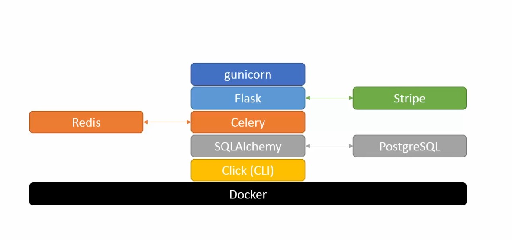

# Design of the app

## Project check-list
- [x] Create basic structure
- [x] Docker setup (v20.10.2)
- [x] Flask app (default Flask app, requirements)
- [x] Some generic content (Added default structure from documentation)
- [x] Add Blueprints (Model-Template-View)
- [x] Add Jinja2 templates (+ Bootstrap's Font Awesome, generic CSS)
- [x] Added some default content (FAQ's, ToS, Policy Page)  
- [x] Testing (pytest, pytest-cov, flake8)
- [x] Added CLI (Click, added testing commands)
- [x] Flask extension (added debug toolbar)
- [x] Form creation (Celery, WTForms, auto-email setup)
- [ ] Admin Dashboard 
- [ ] Logging and error handling
- [ ] CLI additions
- [ ] Add some functionality
- [ ] Payments + Micro-transactions
- [ ] DB migration
- [ ] Done ? or add chat/support bot?
